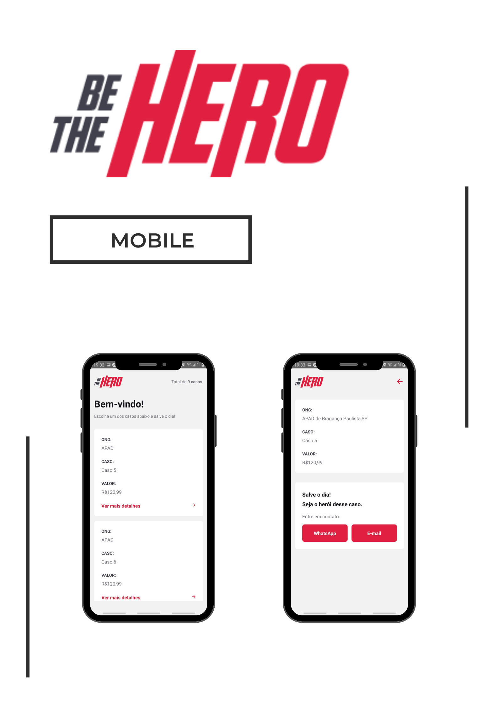
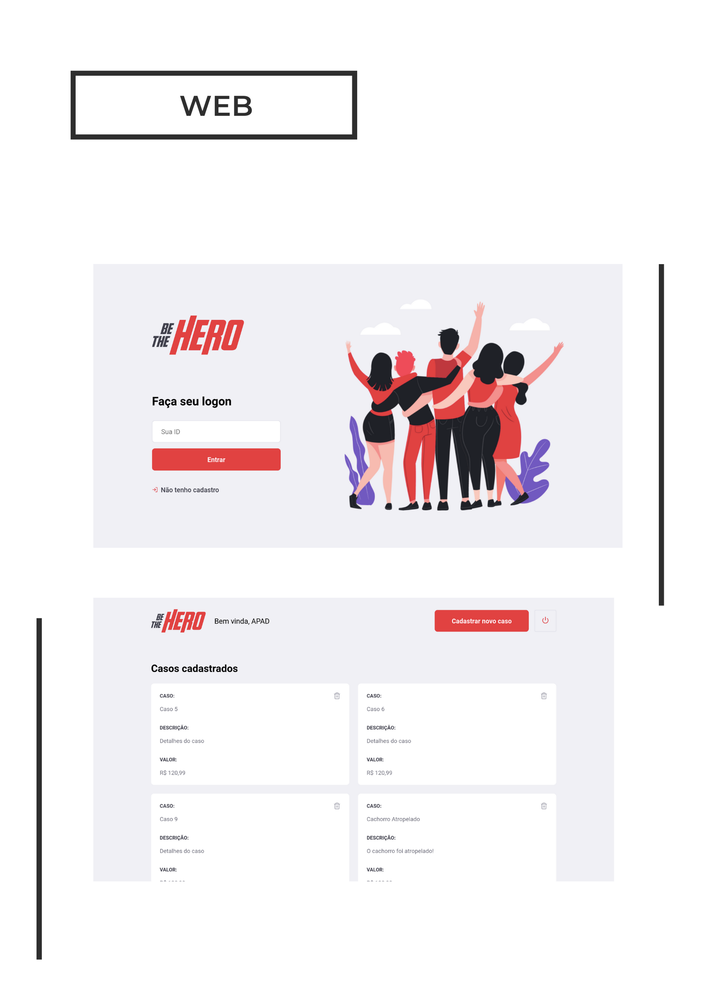

# Be The Hero

**Be The Hero**, an app that is all about helping NGOs to get funding for their causes. The NGOs can register their tasks that need funding and heroes can help causes that they identify with! 🤝️⛑️💰️




## Getting Started

This project is part of the OmniStack 11.0 bootcamp by [RocketSeat](https://rocketseat.com.br)!! Please, check them out!! ⚛️

### Install & Run

Clone this repo!

```
git clone <repo>
cd <repo>
```

#### Server

First you need to set up the server, inside your terminal **run**:

```
cd server
yarn install
yarn start
```

**Remember**, keep this terminal window open!

#### Mobile

To run _in development_ use:

```
cd mobile
yarn install
yarn start
```

#### Web

To run _in development_ use:

```
cd web
yarn install
yarn start
```

## Build With

- NodeJs
- Express
- SQLite
- ReactJs
- React Native
